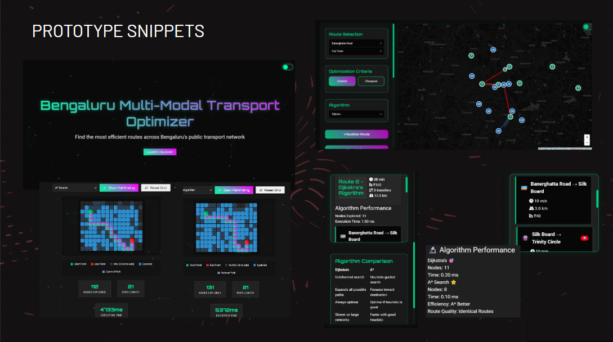
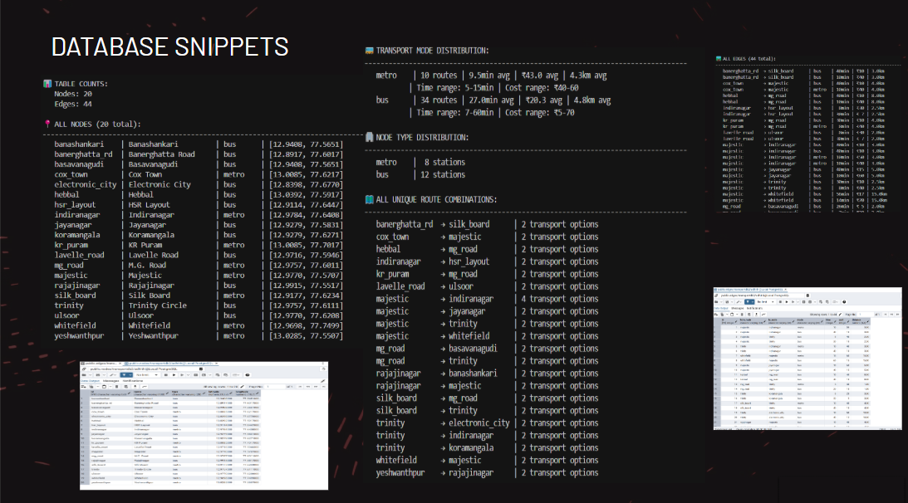

# 🚇 Multi-Modal Public Transport Optimisation

[](https://www.python.org/)
[](https://www.postgresql.org/)
[](https://flask.palletsprojects.com/)

---

## 🌟 Overview

**Multi-Modal Public Transport Optimisation** is an interactive platform for planning, optimising, and visualising public transport routes in Bengaluru. It leverages advanced algorithms and a rich dataset to help users find the fastest or cheapest routes using both metro and bus networks. The project features a modern web interface, real-time analytics, and beautiful map-based visualisations.

---

## 🚀 Features

- **🔎 Fastest & Cheapest Route Finder:**  
  Utilises Dijkstra's algorithm to compute optimal routes based on time or cost.
- **🗺️ Interactive Map Visualisation:**  
  Explore the city's transport network and routes on a dynamic map (Leaflet.js).
- **🚏 Multi-Modal Support:**  
  Integrates metro and bus systems, including seamless transfers.
- **⚡ Real-Time Analytics:**  
  Visualise algorithm performance and route statistics.
- **📊 Data-Driven:**  
  All network data is managed in a PostgreSQL database for scalability and reliability.
- **🖥️ Modern UI:**  
  Responsive, themeable, and user-friendly web interface.

---

## 📸 Screenshots

> 
>

---

## 🏗️ Project Structure

```
bid1/
├── app.py                  # Flask backend API
├── create_database.py      # Script to create the PostgreSQL database
├── seed_database.py        # Script to seed the database with nodes and edges
├── check_schema.py         # Script to verify database schema
├── index.html              # Main web interface
├── visualizer.html         # Advanced visualisation interface
├── visualizer.js           # Frontend logic for visualisation
├── requirements.txt        # Python dependencies
├── styles.css              # Main styles
└── ...                     # Additional assets and scripts
```

---

## ⚙️ Installation & Setup

### 1. Clone the Repository

```sh
git clone https://github.com/Adhithi02/multi-modal-public-transport-optimization.git
cd multi-modal-public-transport-optimization/bid1
```

### 2. Install Python Dependencies

```sh
python -m venv venv
venv\Scripts\activate  # On Windows
# or
source venv/bin/activate  # On Mac/Linux

pip install -r requirements.txt
```

### 3. Set Up PostgreSQL Database

- Ensure PostgreSQL is installed and running.
- Update the `DB_CONFIG` in the Python files if your credentials differ.

#### a. Create the Database

```sh
python create_database.py
```

#### b. Seed the Database

```sh
python seed_database.py
```

#### c. (Optional) Check Database Schema

```sh
python check_schema.py
```

### 4. Run the Backend API

```sh
python app.py
```

- The Flask API will start at `http://localhost:5000/`

### 5. Use the Web Interface

- Open `index.html` in your browser.
- The frontend will connect to the backend API for data and route calculations.

---

## 🧑‍💻 Usage

1. **Select Source and Destination:**  
   Use the dropdowns or click on the map to choose your start and end points.
2. **Choose Criteria:**  
   Select whether you want the fastest or cheapest route.
3. **Visualise Route:**  
   Click "Visualise" to see the optimal route, including all transfers and modes.
4. **Explore Analytics:**  
   View performance metrics and route statistics.

---

## 🛠️ Technologies Used

- **Backend:** Python, Flask, psycopg2
- **Frontend:** HTML5, CSS3, JavaScript, Leaflet.js, Bootstrap
- **Database:** PostgreSQL
- **Data Analysis & Visualisation:** matplotlib, pandas, seaborn, fpdf2

---

## 📚 Contributing

Contributions are welcome! Please open issues or pull requests for improvements, bug fixes, or new features.

---

## 👩‍💻 Contributors

- [Adhithi C Iyer](https://github.com/Adhithi02)
- [Akshatha N](https://github.com/AkshathaN17)
